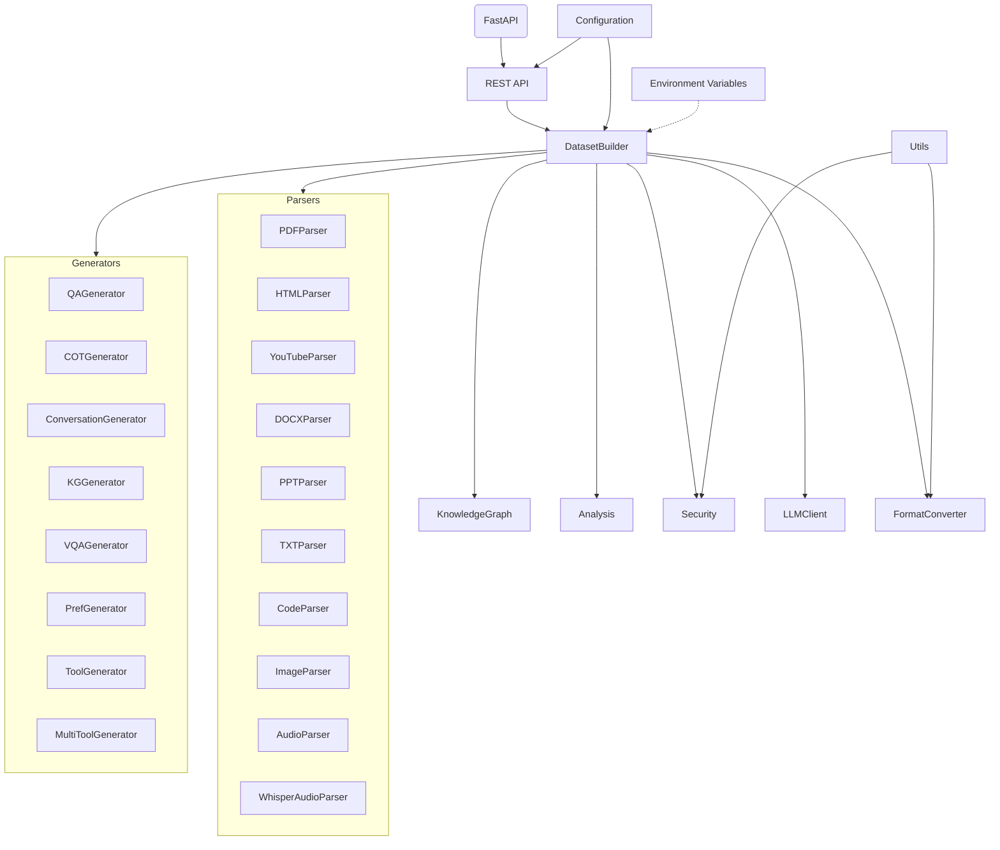
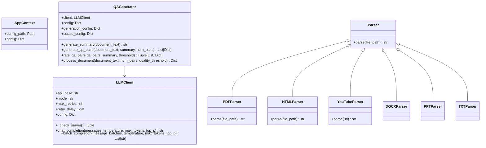
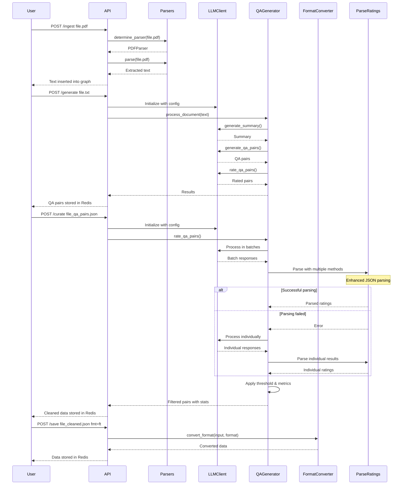
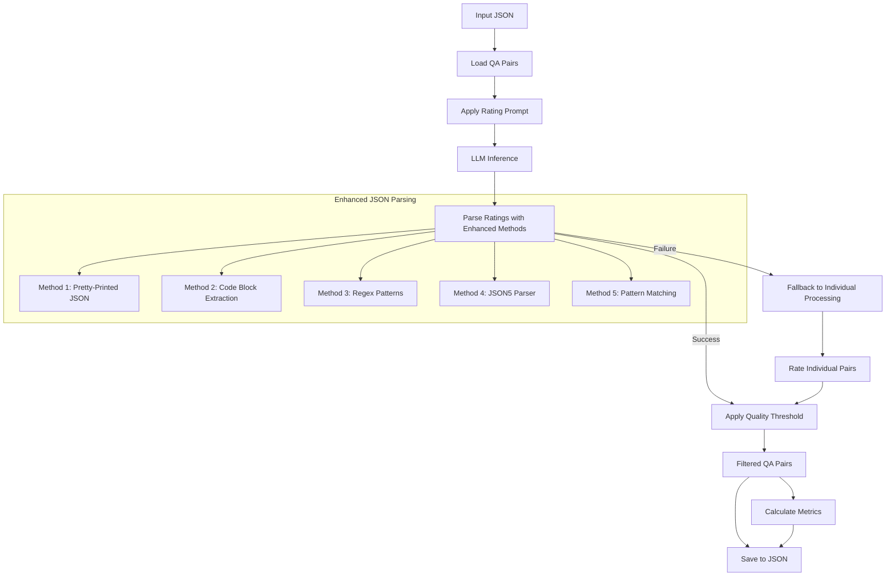

# Datacreek: Comprehensive Documentation

## Table of Contents

1. [Overview](#1-overview)
2. [Architecture](#2-architecture)
3. [Installation](#3-installation)
4. [Configuration System](#4-configuration-system)
5. [Pipeline Stages](#5-pipeline-stages)
6. [Component Reference](#6-component-reference)
7. [Output Formats](#7-output-formats)
8. [Environment Variables](#8-environment-variables)
9. [Workflow Examples](#9-workflow-examples)
10. [Customizing Prompts](#10-customizing-prompts)
11. [Extending the Toolkit](#11-extending-the-toolkit)
12. [Troubleshooting](#12-troubleshooting)
13. [Best Practices](#14-best-practices)
14. [Deployment](#15-deployment)

## 1. Overview

Datacreek is a toolkit for preparing high-quality synthetic datasets to fine-tune Large Language Models (LLMs). The primary interface is a REST API that exposes each step of the data preparation workflow.

All routes are asynchronous. Launch ingestion, generation, curation or saving through `/tasks/ingest`, `/tasks/generate`, `/tasks/curate` and `/tasks/save` and monitor progress via `/tasks/{task_id}`.
Datasets created by these jobs can be managed with `/datasets` (create, update, delete and download). The API records every action in Redis so you can query `/datasets/<name>/progress` for the current status, `/datasets/<name>/history` for past events and `/datasets/<name>/versions` to inspect generation runs. Individual versions may be removed with `DELETE /datasets/<name>/versions/{n}`. Every request requires an `X-API-Key` header associated with a user.
Background jobs are handled by Celery. Configure `CELERY_BROKER_URL` and `CELERY_RESULT_BACKEND` to use an external broker such as Redis.

**Typical workflow**

1. **Ingest sources** – parse documents or URLs, clean the text and insert everything into a dedicated knowledge graph.
2. **Refine the graph** – run optional operations like deduplication, entity resolution or linking to improve data quality.
3. **Generate a dataset** – pick the desired dataset type, training goal and output format. Datacreek selects the matching generation pipeline and populates the dataset from the knowledge graph.
4. **Curation** – apply an initial filter to discard low quality samples.
5. **Dataset operations** – launch additional cleanup steps (deduplicate chunks, normalize dates, link entities, …) if needed.
6. **Export** – download the dataset locally or push it to external storage such as Hugging Face.

### Detailed SaaS Workflow

| Stage | Options | Purpose |
|-------|---------|---------|
| **Ingestion** | Files (PDF, DOCX, PPTX, TXT), web pages, YouTube URLs. Automatic cleaning, entity extraction and multiple chunking strategies. | Convert diverse sources into clean text and insert it in the dataset knowledge graph. |
| **Knowledge graph operations** | `deduplicate_chunks`, `resolve_entities`, linking helpers, pruning unwanted sources. | Improve graph quality by merging duplicates and connecting related nodes. |
| **Dataset generation** | Dataset types (QA, CoT, VQA, etc.), specify training goal and output format. | The app picks the proper pipeline, generates content and formats it accordingly. |
| **Initial curation** | Quality threshold and batch size. | Quickly discard low-quality pairs right after generation. |
| **Dataset operations** | Same helpers as graph operations plus functions like `normalize_date_fields` or `compute_graph_embeddings`. | Further clean up the dataset before exporting. |
| **Export** | Download locally or push to Hugging Face; JSONL, Alpaca, ChatML, OpenAI fine-tuning formats. | Save the final dataset in the desired location and format. |

### Step Reference

Each stage exposes a number of operations. The tables below summarize the most important ones and their goals.

**Ingestion options**

| Option | Purpose |
|--------|---------|
| `extract_entities` | create entity nodes while parsing |
| `extract_facts` | populate fact nodes using regex or LLM |
| `high_res` / `ocr` | better PDF and image extraction |
| `chunk_method` | `basic`, `sliding`, `semantic`, `contextual` or `summary` |

**Knowledge graph operations**

| Operation | Purpose |
|-----------|---------|
| `deduplicate_chunks()` | remove identical text chunks |
| `resolve_entities()` | merge aliases into canonical entities |
| `link_chunks_by_entity()` | connect chunks sharing the same entity |
| `link_documents_by_entity()` | link documents that mention the same entity |
| `link_authors_organizations()` | connect authors to their organisations |
| `prune_sources()` | remove unwanted sources |
| `compute_graph_embeddings()` | build Node2Vec embeddings on nodes |
| `compute_node2vec_gds()` | Neo4j GDS Node2Vec on the database |
| `compute_graphsage_embeddings()` | mean-aggregated GraphSAGE vectors |
| `compute_transe_embeddings()` | TransE-style relation embeddings |
| `compute_distmult_embeddings()` | DistMult-style relation embeddings |
| `compute_product_manifold_embeddings()` | fuse Poincaré and Node2Vec vectors |
| `train_product_manifold_embeddings()` | optimize embeddings with simple product loss |
| `compute_aligned_cca_embeddings()` | low-rank A-CCA between Node2Vec and GraphWave |
| `multiview_contrastive_loss()` | compute InfoNCE loss across the three views |
| `compute_meta_embeddings()` | generate 64D meta-embeddings via autoencoder |
| `compute_hyper_sagnn_head_drop_embeddings()` | Hyper-SAGNN embeddings with HEAD-Drop |
| `compute_graphwave_embeddings(chebyshev_order=m)` | GraphWave using Chebyshev order `m` |
| `hyper_adamic_adar_scores()` | compute Hyper-Adamic–Adar link scores |
| `edge_attention_scores()` | mean attention weight per hyperedge |
| `hybrid_score()` | :math:`\gamma \cos(\text{n2v}) + \eta (1-d_B) + (1-\gamma-\eta)(1-\cos(\text{gw}))` |
| `rollback_gremlin_diff()` | export git diff patch for rollback |
| `SheafSLA` | measure mean time to recovery for sheaf checks |
| `mapper_nerve(radius)` | compute or fetch cached Mapper nerve |
| `clear_mapper_cache()` | drop cached Mapper nerve results |
| `prune_fractalnet(weights, ratio)` | magnitude-based pruning of model weights |
| `colour_box_dimension(radii)` | GPU-style box counting for fractal dim |
| `adaptive_triangle_threshold()` | derive triangle cutoff from edge weight entropy |
| `partition_files_to_atoms(path)` | split file into text atoms |
| `parse_code_to_atoms(path)` | split Python source into code atoms |
| `transcribe_audio(path)` | Whisper transcription of audio |
| `blip_caption_image(path)` | generate image caption with BLIP |
| `similar_by_hybrid()` | rank nodes by combined hyperbolic/Euclidean/spectral score |
| `ann_hybrid_search()` | FAISS pre-filter then :math:`\gamma \cos(\text{n2v}) + \eta (1-d_B) + (1-\gamma-\eta)(1-\cos(\text{gw}))` |
| `cypher_ann_query()` | run Cypher on ANN results |
| `apply_k_out_privacy()` | apply k-out randomized response to ID lists |
| `governance_metrics()` | compute alignment, crowding and bias indicators |
| `mitigate_bias_wasserstein(groups)` | rescale embeddings to reduce group bias |
| `average_hyperbolic_radius()` | mean radius of Poincaré embeddings |
| `filter_semantic_cycles()` | remove trivial GraphRNN cycles |
| `persistence_wasserstein_distance()` | Wasserstein distance between persistence diagrams |
| `tpl_correct_graph()` | Wasserstein-based topology correction |
| `sheaf_consistency_score()` | measure sheaf coherence on the graph |
| `sheaf_cohomology_blocksmith()` | approximate H^1 via block reduction |
| `sheaf_consistency_score_batched()` | batch version of sheaf score |
| `spectral_bound_exceeded(k, tau)` | check if λ_k exceeds τ to stop search |
| `autotune_step()` | update parameters using entropy, MDL and recall@k |
| `svgp_ei_propose()` | propose new hyperparameters via SVGP-EI |
| `kw_gradient(f,x,h,n)` | stochastic gradient estimate used in autotuning |
| `recall_at_k()` | compute mean recall@k for query nodes |
| `build_faiss_index(method="flat"|"hnsw")` | build a FAISS index |
| `search_faiss(adaptive=True)` | search with latency-aware HNSW switch |
| `add_privacy_budget()` | register a DP epsilon budget per user |
| `consume_privacy_budget(window)` | spend epsilon within a sliding window |
| `mark_conflicting_facts()` | flag contradictory facts |
| `hyperbolic_neighbors()` | nearest neighbors in Poincaré space |
| `hyperbolic_reasoning()` | greedy path in hyperbolic space |
| `hyperbolic_hypergraph_reasoning()` | path using hyperedges and penalty |
| `hyperbolic_multi_curvature_reasoning()` | reasoning across curvature levels |
| `predict_hyperedges()` | suggest new hyperedges via similarity |
| `diversification_score(nodes, radii)` | coverage score for node sets |
| `select_diverse_nodes(cands, count, radii)` | pick nodes maximizing diversification |
| `sample_diverse_chunks(count, radii)` | grab chunks from unexplored regions |
| `dimension_distortion(radii)` | difference between graph and embedding dimensions |
| `embedding_box_counting_dimension(attr, radii)` | fractal dimension of stored embeddings |
| `fractal_information_metrics(radii, max_dim)` | entropy and MDL across radii |

**Dataset generation**

| Parameter | Purpose |
|-----------|---------|
| `dataset_type` | choose QA, CoT, VQA, KG, preferences … |
| `training_goal` | pick SFT, DPO, PPO, etc. |
| `fmt` | output format like JSONL or ChatML |

**Curation options**

| Parameter | Purpose |
|-----------|---------|
| `threshold` | minimum score to keep a sample |
| `batch_size` | how many pairs to rate at once |
| `temperature` | sampling temperature for the rating prompt |

**Dataset cleanup operations**

| Operation | Purpose |
|-----------|---------|
| `clean_chunks()` | strip markup and whitespace |
| `normalize_date_fields()` | standardize date attributes |
| `deduplicate_pairs()` | drop near-duplicate examples |

**Export options**

| Parameter | Purpose |
|-----------|---------|
| `fmt` | final format (jsonl, alpaca, chatml, ft) |
| `repo` | optional Hugging Face repository |


### Design:

- **Document Parsing**: Convert various file formats (PDF, HTML, YouTube, DOCX, PPTX, TXT) to clean text
- **Content Generation**: Generate high-quality QA pairs using local LLM inference
- **Quality Control**: Filter content based on quality metrics
- **Format Conversion**: Export to various training formats (JSONL, Alpaca, OpenAI FT, ChatML)
- **Configurable**: All aspects controlled via YAML configuration
- **Extensible**: Easy to add new parsers, generators, or output formats

## 2. Architecture

### System Overview

Datacreek follows a modular architecture with these main components:



### Directory Structure

```
datacreek/
├── datacreek/                  # Application source code
│   ├── __init__.py
│   ├── core/                   # Pipeline stages
│   │   ├── __init__.py
│   │   ├── context.py
│   │   ├── ingest.py
│   │   ├── create.py
│   │   ├── cleanup.py
│   │   ├── curate.py
│   │   ├── dataset.py
│   │   └── save_as.py
│   ├── parsers/                # Document and media parsers
│   │   ├── __init__.py
│   │   ├── pdf_parser.py
│   │   ├── html_parser.py
│   │   ├── youtube_parser.py
│   │   ├── docx_parser.py
│   │   ├── ppt_parser.py
│   │   ├── txt_parser.py
│   │   ├── code_parser.py
│   │   ├── image_parser.py
│   │   ├── audio_parser.py
│   │   └── whisper_audio_parser.py
│   ├── generators/             # Dataset generators
│   │   ├── qa_generator.py
│   │   ├── cot_generator.py
│   │   ├── vqa_generator.py
│   │   ├── kg_generator.py
│   │   ├── pref_generator.py
│   │   ├── conversation_generator.py
│   │   ├── tool_generator.py
│   │   └── multi_tool_generator.py
│   ├── models/
│   │   └── llm_client.py
│   ├── analysis/               # Metrics and math helpers
│   ├── security/               # Privacy utilities
│   ├── utils/                  # Shared utilities
│   └── server/                 # FastAPI app
├── configs/                    # Configuration files
│   └── config.yaml
├── frontend/                   # React web interface
├── scripts/                    # Utility scripts
├── docker-compose.yml          # Compose stack for local development
├── Dockerfile                  # API container image
└── README.md                   # Project readme
```

### Class Diagram



### Data Flow



## 3. Installation

### Requirements

- Python 3.8 or later
- VLLM for local inference (recommended)

### Installation

Clone the repository and install the dependencies in a virtual environment:

```bash
git clone https://github.com/meta-llama/datacreek.git
cd datacreek
python -m venv .venv
source .venv/bin/activate
pip install -r requirements.txt
```

### Setting Up VLLM

For local inference, you'll need to install and run VLLM:

```bash
pip install vllm

# Start the VLLM server with your preferred model
vllm serve meta-llama/Llama-3.3-70B-Instruct --port 8000
```


## 5. Configuration System

Datacreek uses a YAML-based configuration system with a central config file.

### Configuration File Structure

```yaml


# vllm: Configure VLLM server settings
vllm:
  api_base: "http://localhost:8000/v1"
  port: 8000
  model: "meta-llama/Llama-3.3-70B-Instruct"
  max_retries: 3
  retry_delay: 1.0

# generation: Content generation parameters
generation:
  temperature: 0.7
  top_p: 0.95
  chunk_size: 4000
  overlap: 200
  max_tokens: 4096
  num_pairs: 25
  batch_size: 32    # Number of requests to batch together

# curate: Content filtering parameters
curate:
  threshold: 7.0
  batch_size: 8
  temperature: 0.1

# format: Export format parameters
format:
  default: "jsonl"
  include_metadata: true
  pretty_json: true

# prompts: LLM prompts for different tasks
prompts:
  summary: |
    Summarize this document in 3-5 sentences, focusing on the main topic and key concepts.

  qa_generation: |
    Create {num_pairs} question-answer pairs from this text for LLM training.
    
    Rules:
    1. Questions must be about important facts in the text
    2. Answers must be directly supported by the text
    3. Return JSON format only:
    
    [
      {{
        "question": "Question 1?",
        "answer": "Answer 1."
      }},
      {{
        "question": "Question 2?",
        "answer": "Answer 2."
      }}
    ]
    
    Text:
    {text}

  qa_rating: |
    You are a helpful JSON processor that rates question-answer pairs.
    
    Your task is to rate each pair on a scale from 1-10 and return valid JSON with added ratings.
    
    ONLY return a valid JSON array with the original pairs plus ratings. Do not include any explanations or text outside the JSON.
    
    Here are the pairs to rate:
    
    {pairs}
```

### Using Custom Configurations

Provide a custom configuration file when starting the service:

```bash
curl -X POST localhost:8000/ingest -H "X-Config-Path: custom_config.yaml" -d "path=documents/paper.pdf"
```

### Configuration Priorities

The toolkit resolves configuration values in the following order:

1. Environment variables
2. Custom configuration file (if specified)
3. Default configuration values (lowest priority)

### Configuration API

```python
from datacreek.utils.config import (
    load_config,
    get_vllm_config,
    get_generation_config,
    get_curate_config,
    get_format_config,
    get_prompt
)

# Load config from file
config = load_config("path/to/config.yaml")

# Get specific configuration sections
vllm_config = get_vllm_config(config)
generation_config = get_generation_config(config)
curate_config = get_curate_config(config)
format_config = get_format_config(config)

# Get prompt template
summary_prompt = get_prompt(config, "summary")
```

## 6. Pipeline Stages

### Stage 1: Document Parsing (Ingest)

The `ingest` stage converts various document formats to plain text. Each dataset
is backed by its own knowledge graph: as you ingest data, the documents and
chunks are inserted into this graph with a `source` attribute linking back to
their origin. Subsequent generation pipelines operate on the graph built for the
current dataset.


Images encountered during ingestion are captioned with a BLIP model and stored
alongside their caption as ``alt_text``. Audio files are transcribed with
Whisper and linked back to the corresponding chunks in the graph. When
``quantulum3`` and ``pint`` are available, detected quantities are converted to
SI units during the cleaning step.

#### Parser Selection Logic

The toolkit selects the appropriate parser based on the file extension or URL pattern:

```python
def determine_parser(file_path, config):
    # URL handling
    if file_path.startswith(('http://', 'https://')):
        if 'youtube.com' in file_path or 'youtu.be' in file_path:
            return YouTubeParser()
        else:
            return HTMLParser()
    
    # File handling
    ext = os.path.splitext(file_path)[1].lower()
    parsers = {
        '.pdf': PDFParser(),
        '.html': HTMLParser(),
        '.htm': HTMLParser(),
        '.docx': DOCXParser(),
        '.pptx': PPTParser(),
        '.txt': TXTParser(),
    }
    
    if ext in parsers:
        return parsers[ext]
    else:
        raise ValueError(f"Unsupported file extension: {ext}")
```

### Stage 2: Content Generation (Create)

The `create` stage generates content from the parsed content stored in the knowledge graph.


#### Text Chunking

For long documents, the text is split into manageable chunks. Datacreek provides
multiple strategies controlled via the configuration:

* **basic** – split on paragraphs with limited overlap (default)
* **sliding** – fixed-size sliding window with overlap
* **semantic** – break sentences where the embedding similarity drops below a threshold

Example implementation:

```python
def split_into_chunks(
    text: str,
    chunk_size: int = 4000,
    overlap: int = 200,
    method: str | None = None,
    similarity_drop: float = 0.3,
) -> List[str]:
    if method == "sliding":
        return sliding_window_chunks(text, chunk_size, overlap)
    if method == "semantic":
        return semantic_chunk_split(text, chunk_size, similarity_drop)
    ...
```

### Stage 3: Content Filtering (Cleanup)

The `cleanup` stage filters content based on quality.



#### Quality Rating Logic

The curate module processes QA pairs in batches for efficiency, with robust error handling and fallback mechanisms. The system has been enhanced to handle JSON parsing edge cases and provide detailed diagnostic information.

```python
def curate_qa_pairs(input_data, threshold=None, api_base=None, model=None, config_path=None, verbose=False):
    """Clean and filter QA pairs based on quality ratings."""
    if isinstance(input_data, str):
        data = json.loads(Path(input_data).read_text()) if Path(input_data).exists() else json.loads(input_data)
    else:
        data = input_data
    qa_pairs = data.get("qa_pairs", [])
    summary = data.get("summary", "")
    # ... rating logic ...
    return {"qa_pairs": filtered_pairs, "summary": summary}
```

The system includes several advanced features:

1. **Batch Size Configuration**: Configurable batch sizes for optimal performance
2. **Environment Variable Overrides**: `SDK_BATCH_SIZE` for debugging and testing
3. **Fallback Processing**: If batch processing fails, falls back to single-item processing
4. **Robust JSON Parsing**: Multiple parsing methods to handle different LLM output formats
5. **Verbose Mode: Enable detailed diagnostics with the `SDK_VERBOSE` environment variable

### Stage 4: Format Conversion (Save-as)

The `save-as` stage converts the content to different formats.


#### Format Converter Logic

```python
def convert_format(input_path, format_type):
    # Load input file
    with open(input_path, "r", encoding="utf-8") as f:
        data = json.load(f)

    # Extract QA pairs
    if "filtered_pairs" in data:
        qa_pairs = data["filtered_pairs"]
    elif "qa_pairs" in data:
        qa_pairs = data["qa_pairs"]
    else:
        raise ValueError("No QA pairs found in input file")

    # Convert to requested format
    if format_type == "jsonl":
        return to_jsonl(qa_pairs)
    elif format_type == "alpaca":
        return to_alpaca(qa_pairs)
    elif format_type == "ft":
        return to_fine_tuning(qa_pairs)
    elif format_type == "chatml":
        return to_chatml(qa_pairs)
    else:
        raise ValueError(f"Unknown format type: {format_type}")
```

### Dataset Generation Pipelines

After ingestion, each dataset contains its own knowledge graph. Generation
pipelines read from this per-dataset graph and are tailored to the downstream
training goal.  The graph exposes simple search utilities to locate chunks
matching a query:

```python
from datacreek import DatasetBuilder, DatasetType

ds = DatasetBuilder(DatasetType.QA)
ds.add_document("doc1", source="paper.pdf")
ds.add_chunk("doc1", "c1", "hello world")
ds.add_image("doc1", "img0", "pages/img0.png", page=1)
matches = ds.search("world")
doc_matches = ds.search_documents("paper")
chunk_ids = ds.get_chunks_for_document("doc1")
image_ids = ds.get_images_for_document("doc1")

# Embedding-based retrieval
ds.graph.index.build()
retrieved = ds.graph.search_embeddings("hello", k=1)
retrieved_hybrid = ds.graph.search_hybrid("hello")
deep = ds.search_with_links("hello", hops=1)
deep_data = ds.search_with_links_data("hello", hops=1)
# each item includes hop depth and the traversal path

# Clone the dataset to try different curation strategies
ds_copy = ds.clone(name="copy")
```

### Search Functions

Datacreek exposes several helper methods to query the knowledge graph:

````python
ds.search("world")                        # lexical search
ds.graph.search_embeddings("hello")       # embedding search
ds.graph.search_hybrid("hello")           # lexical + embedding
ds.ann_hybrid_search(q_n2v, q_gw, q_hyp)  # FAISS + hybrid score
ds.graph.similar_by_hybrid("c1")          # rank nodes by hybrid similarity
ds.search_with_links("hello", hops=1)     # expand via graph links
ds.search_with_links_data("hello", hops=1)  # includes traversal path
score = ds.hybrid_score("c1", "c2")        # multi-view similarity
ds.cypher_ann_query(driver, "hello", "MATCH (n) WHERE n.id IN $ids RETURN n")
ds.hyperbolic_neighbors("c1")               # closest nodes in Poincaré space
ds.hyperbolic_reasoning("c1", "c5")         # greedy path via embeddings
````

``cypher_ann_query`` first retrieves the top ``k`` ANN candidates from
``query`` and runs the supplied Cypher statement with the variable ``ids``
bound to those identifiers. Use this helper when you need custom graph
queries but still want to narrow the search via embeddings.

``search_with_links`` performs a hybrid search and then traverses
``next_chunk`` and ``similar_to`` relations up to ``hops`` deep to gather
related chunks. ``search_with_links_data`` returns the same results with
extra fields such as the hop ``depth`` and traversal ``path``.

``ann_hybrid_search`` uses a FAISS index to fetch ``ann_k`` candidates
based on Node2Vec similarity. Each candidate is scored with the
multi-view formula below, and the top ``k`` results are returned.

``similar_by_hybrid`` performs the same scoring but compares a query node
against every candidate in the graph without the FAISS pre-filter.

``hyperbolic_neighbors`` returns the closest nodes according to the
Poincaré distance :math:`d_{\mathbb{B}}`. ``hyperbolic_reasoning`` then
links the start node to the goal by greedily selecting the neighbor with
the smallest hyperbolic distance at each step.
``hyperbolic_hypergraph_reasoning`` and
``hyperbolic_multi_curvature_reasoning`` extend this idea by
respectively traversing hyperedges with a penalty term and mixing
embeddings of several curvatures.

``hybrid_score`` combines Node2Vec cosine similarity, Poincar\xe9 distance
and GraphWave similarity. The similarity is

.. math::

    S = \gamma \cos(\text{n2v}) + \eta (1 - d_{\mathbb{B}}) +
    (1-\gamma-\eta)(1 - \cos(\text{gw}))

where ``cos(n2v)`` is the cosine similarity of Node2Vec embeddings,
``d_{\mathbb{B}}`` is the Poincar\xe9 distance of hyperbolic embeddings and
``cos(gw)`` is the cosine similarity of GraphWave vectors. ``gamma`` and
``eta`` in ``[0,1]`` control the weight of the Euclidean and hyperbolic
terms.

| Dataset type | Compatible trainings |
|--------------|---------------------|
| `qa`         | SFT, DPO, ORPO, DPO+SFT, PPO, RRHF, RLAIF, GRPO |
| `cot`        | SFT, DPO, ORPO, DPO+SFT, RRHF |
| `vqa`        | SFT |
| `text`       | CPT |
| `kg`         | SFT, DPO, ORPO, DPO+SFT, PPO, RRHF, RLAIF, GRPO |
| `pref_pair`  | PPO, DPO, ORPO, DPO+SFT, RLAIF |
| `pref_list`  | GRPO, RRHF |
| `tool`       | SFT, DPO, ORPO, DPO+SFT, PPO, RRHF, RLAIF, GRPO |
| `conversation` | SFT, DPO, ORPO, DPO+SFT, PPO, RRHF, RLAIF, GRPO |
| `multi_tool` | SFT, DPO, ORPO, DPO+SFT, PPO, RRHF, RLAIF, GRPO |

### Fractal Metrics

Functions such as ``embedding_box_counting_dimension`` and
``dimension_distortion`` evaluate how closely the hyperbolic embeddings
match the original graph structure. Provide a list of radii ``r`` to compute
the box counting dimension and the discrepancy between the graph and its
embedding:

```python
dim, counts = ds.embedding_box_counting_dimension("poincare_embedding", r)
dist = ds.dimension_distortion(r)
```

The distortion corresponds to the absolute difference between the fractal
dimension ``D_graph`` of the original graph and the dimension ``D_emb`` of its
Poincaré embedding:

.. math::

    |D_{graph} - D_{emb}|

``diversification_score`` measures how much a set of nodes covers previously
unexplored regions. ``select_diverse_nodes`` returns the best subset while
``sample_diverse_chunks`` draws representative chunks. The helper
``fractal_information_metrics`` summarizes entropy and description length as
the radius grows.

### Training-Specific Pipelines

Below is a summary of which dataset types can be generated for each training goal.

| Training goal | Supported dataset types |
|---------------|-----------------------|
| SFT | qa, cot, vqa, kg, tool, conversation, multi_tool |
| DPO | qa, cot, kg, pref_pair, tool, conversation, multi_tool |
| ORPO | qa, cot, kg, pref_pair, tool, conversation, multi_tool |
| DPO+SFT | qa, cot, kg, pref_pair, tool, conversation, multi_tool |
| PPO | qa, kg, pref_pair, tool, conversation, multi_tool |
| RRHF | qa, cot, kg, pref_list, tool, conversation, multi_tool |
| RLAIF | qa, kg, pref_pair, tool, conversation, multi_tool |
| GRPO | qa, kg, pref_list, tool, conversation, multi_tool |
| CPT | text |

```python
from datacreek import get_dataset_types_for_training, TrainingGoal
print(get_dataset_types_for_training(TrainingGoal.DPO))
```

You can query the available pipelines in code:

```python
from datacreek import get_pipelines_for_training, TrainingGoal

print(get_pipelines_for_training(TrainingGoal.SFT))
```

## 7. Component Reference

### LLMClient

```python
class LLMClient:
    def __init__(self, 
                 config_path: Optional[Path] = None,
                 api_base: Optional[str] = None, 
                 model_name: Optional[str] = None,
                 max_retries: Optional[int] = None,
                 retry_delay: Optional[float] = None):
        """Initialize an OpenAI-compatible client that connects to a VLLM server"""
    
    def chat_completion(self, 
                       messages: List[Dict[str, str]], 
                       temperature: float = None, 
                       max_tokens: int = None,
                       top_p: float = None) -> str:
        """Generate a chat completion using the VLLM OpenAI-compatible API"""
    
    def batch_completion(self, 
                        message_batches: List[List[Dict[str, str]]], 
                        temperature: float = None, 
                        max_tokens: int = None,
                        top_p: float = None) -> List[str]:
        """Process multiple message sets sequentially"""
```

### QAGenerator

```python
class QAGenerator:
    def __init__(self, 
                 client: LLMClient,
                 config_path: Optional[Path] = None):
        """Initialize the QA Generator with an LLM client and optional config"""
    
    def generate_summary(self, document_text: str) -> str:
        """Generate a summary of the document"""
    
    def generate_qa_pairs(self, 
                        document_text: str, 
                        summary: str, 
                        num_pairs: int = 25) -> List[Dict[str, str]]:
        """Generate QA pairs from the document"""
    
    def rate_qa_pairs(self, 
                     qa_pairs: List[Dict[str, str]], 
                     summary: str, 
                     threshold: Optional[float] = None) -> Tuple[List[Dict[str, Any]], Dict[str, Any]]:
        """Rate and filter QA pairs by quality"""
    
    def process_document(self, 
                        document_text: str, 
                        num_pairs: int = 25, 
                        quality_threshold: Optional[float] = None) -> Dict[str, Any]:
        """Process a document to generate, rate, and format QA pairs"""
```

### Document Parsers

```python
class Parser:
    def parse(self, file_path: str) -> str:
        """Parse a document into plain text"""
```

Each parser implements this interface:

- `PDFParser`: Uses `unstructured` to extract text from PDF files
- `HTMLParser`: Uses `unstructured` to extract text from HTML/web pages
- `YouTubeParser`: Uses pytube and youtube-transcript-api to extract transcripts
- `DOCXParser`: Uses `unstructured` to extract text from Word documents
- `PPTParser`: Uses `unstructured` to extract text from PowerPoint presentations
- All parsers rely on `unstructured` partitions so text and images become separate elements
- `TXTParser`: Reads plain text files

### Utility Functions

```python
# Text Processing
def split_into_chunks(text: str, chunk_size: int = 4000, overlap: int = 200) -> List[str]:
    """Split text into chunks with optional overlap"""

def clean_text(text: str) -> str:
    """Normalize text using ``unstructured`` cleaners."""

def normalize_units(text: str) -> str:
    """Convert detected quantities in ``text`` to SI units when `quantulum3` and
    `pint` are available."""
# LLM Output Processing
def parse_qa_pairs(text: str) -> List[Dict[str, str]]:
    """Parse QA pairs from LLM output"""
    
def parse_ratings(text: str) -> List[Dict[str, Any]]:
    """Parse rated items from LLM output"""
    
def convert_to_conversation_format(qa_pairs: List[Dict[str, str]]) -> List[List[Dict[str, str]]]:
    """Convert QA pairs to conversation format"""

# Format Conversion
def to_jsonl(data: List[Dict[str, Any]]) -> str:
    """Convert data to JSONL format and return a JSONL string"""
    
def to_alpaca(qa_pairs: List[Dict[str, str]]) -> str:
    """Convert QA pairs to Alpaca format."""
    
def to_fine_tuning(qa_pairs: List[Dict[str, str]]) -> str:
    """Convert QA pairs to fine-tuning format."""
    
def to_chatml(qa_pairs: List[Dict[str, str]]) -> str:
    """Convert QA pairs to ChatML format as JSONL."""
```

## 8. Output Formats

### Generated QA Pairs Format

```json
{
  "summary": "Document summary text",
  "qa_pairs": [
    {
      "question": "What is X?",
      "answer": "X is..."
    },
    // More QA pairs...
  ],
  "filtered_pairs": [
    {
      "question": "What is X?",
      "answer": "X is...",
      "rating": 8.5
    },
    // More rated pairs...
  ],
  "conversations": [
    [
      {"role": "system", "content": "You are a helpful AI assistant."},
      {"role": "user", "content": "What is X?"},
      {"role": "assistant", "content": "X is..."}
    ],
    // More conversations...
  ],
  "metrics": {
    "total": 25,
    "filtered": 18,
    "retention_rate": 0.72,
    "avg_score": 7.8
  }
}
```

### Export Formats

#### Content Formats

##### JSONL Format

```jsonl
{"question": "What is X?", "answer": "X is..."}
{"question": "How does Y work?", "answer": "Y works by..."}
```

##### Alpaca Format

```json
[
  {
    "instruction": "What is X?",
    "input": "",
    "output": "X is..."
  },
  {
    "instruction": "How does Y work?",
    "input": "",
    "output": "Y works by..."
  }
]
```

##### Fine-Tuning (FT) Format

```json
[
  {
    "messages": [
      {"role": "system", "content": "You are a helpful assistant."},
      {"role": "user", "content": "What is X?"},
      {"role": "assistant", "content": "X is..."}
    ]
  },
  {
    "messages": [
      {"role": "system", "content": "You are a helpful assistant."},
      {"role": "user", "content": "How does Y work?"},
      {"role": "assistant", "content": "Y works by..."}
    ]
  }
]
```

##### ChatML Format

```jsonl
{"messages":[{"role":"system","content":"You are a helpful AI assistant."},{"role":"user","content":"What is X?"},{"role":"assistant","content":"X is..."}]}
{"messages":[{"role":"system","content":"You are a helpful AI assistant."},{"role":"user","content":"How does Y work?"},{"role":"assistant","content":"Y works by..."}]}
```

#### Storage Formats

##### JSON Files (Default)

Content is stored in standard JSON files as shown in the formats above.

##### Hugging Face Datasets (Arrow Format)

Content can be stored as Hugging Face datasets using the efficient Arrow format, which provides:

- Memory-efficient storage (memory-mapped files)
- Fast random access to data
- Column-oriented storage for efficient operations
- Native compatibility with the HF ecosystem
- Better performance for ML workflows

```python
# Example of loading and using a HF dataset
from datasets import load_from_disk

# Load the dataset
dataset = load_from_disk('example_ft_hf')

# View the features
print(dataset.features)
# Example output: {'messages': [{'content': Value(dtype='string', id=None), 'role': Value(dtype='string', id=None)}]}

# Access the first example
print(dataset[0])
# Example output: {'messages': [{'role': 'system', 'content': '...'}, {'role': 'user', 'content': '...'}, ...]}

# Use with training libraries
import transformers
trainer = transformers.Trainer(
    model=model,
    train_dataset=dataset,
    # other parameters...
)
```

## 9. Environment Variables

The toolkit supports these environment variables for debugging and configuration:

| Variable | Description | Default | Example |
|----------|-------------|---------|---------|
| `SDK_VERBOSE` | Enable verbose output for all operations | `false` | `export SDK_VERBOSE=true` |
| `SDK_BATCH_SIZE` | Override batch size for curate command | Config setting | `export SDK_BATCH_SIZE=1` |

Setting these variables can help with debugging and performance tuning:

```bash
# Process one QA pair at a time with detailed output
export SDK_VERBOSE=true
export SDK_BATCH_SIZE=1
curl -X POST localhost:8000/curate -d "ds_key=dataset:results"
```

## 10. Workflow Examples

### Basic Workflow

```bash
# Start VLLM server (in a separate terminal)
vllm serve meta-llama/Llama-3.3-70B-Instruct --port 8000

# Check if server is running
curl http://localhost:8000/v1/models

# 1. Parse a PDF document
curl -X POST localhost:8000/ingest -d "path=documents/paper.pdf"

# 2. Generate QA pairs from the parsed content
curl -X POST localhost:8000/generate -d "src_id=1"

# 3. Clean and filter the generated content
curl -X POST localhost:8000/curate -d "ds_id=1"

# 4. Convert to fine-tuning format
curl -X POST localhost:8000/save -d "ds_id=1&fmt=ft"
```

### Advanced Configuration Example

Create a custom configuration file `technical_docs.yaml`:

```yaml
vllm:
  model: "meta-llama/Llama-3.3-70B-Instruct"

generation:
  temperature: 0.5
  chunk_size: 3000
  overlap: 300
  num_pairs: 40

cleanup:
  threshold: 8.0
  temperature: 0.05

prompts:
  qa_generation: |
    Create {num_pairs} question-answer pairs about technical documentation.
    
    Focus on questions that:
    1. Test understanding of complex technical concepts
    2. Include code examples and implementation details
    3. Cover API usage patterns
    
    Return only the JSON:
    [
      {{
        "question": "Technical question?",
        "answer": "Technical answer with code if relevant."
      }}
    ]
    
    Text:
    {text}
```

Use the custom configuration:

```bash
# Process technical documentation with custom config
curl -X POST localhost:8000/ingest -H "X-Config-Path: technical_docs.yaml" -d "path=documentation/api_docs.pdf"
curl -X POST localhost:8000/generate -H "X-Config-Path: technical_docs.yaml" -d "src_id=1"
curl -X POST localhost:8000/curate -H "X-Config-Path: technical_docs.yaml" -d "ds_id=1"
curl -X POST localhost:8000/save -H "X-Config-Path: technical_docs.yaml" -d "ds_id=1&fmt=ft"
```

### Processing Multiple Files

```bash
# Process all PDFs in a directory
for file in documents/*.pdf; do
  filename=$(basename "$file" .pdf)

  # Ingest
  curl -X POST localhost:8000/ingest -d "path=$file"

  # Create QA pairs
  curl -X POST localhost:8000/generate -d "src_id=1&num_pairs=20"

  # Curate
  curl -X POST localhost:8000/curate -d "ds_id=1&threshold=7.5"

  # Save as fine-tuning format
  curl -X POST localhost:8000/save -d "ds_id=1&fmt=ft"
done
```

## 11. Customizing Prompts

### Summary Generation Prompt

```yaml
prompts:
  summary: |
    Create a comprehensive summary of this technical document.
    
    Include:
    1. The main topic and purpose
    2. Key technical concepts and methodologies
    3. Important findings or conclusions
    4. System architecture or design patterns
    
    Focus on extracting the most technically relevant information.
```

### QA Generation Prompt

```yaml
prompts:
  qa_generation: |
    You're an expert creating training data for a technical assistant.
    
    From this text, create {num_pairs} question-answer pairs that:
    1. Focus on complex technical concepts
    2. Include implementation details and practical usage
    3. Cover both basic and advanced topics
    4. Represent realistic user queries
    
    Each answer should be comprehensive yet concise, and include code examples where relevant.
    
    Return as JSON:
    [
      {{
        "question": "How does X work in system Y?",
        "answer": "X works in system Y by... For example: `code example`"
      }}
    ]
    
    Text:
    {text}
```

### QA Rating Prompt

```yaml
prompts:
  qa_rating: |
    Evaluate these QA pairs for a technical assistant on a scale of 1-10.
    
    Criteria:
    1. Technical accuracy (0-3 points)
    2. Completeness of answer (0-3 points)
    3. Relevance to practical usage (0-2 points)
    4. Clear explanations (0-2 points)
    
    Return the original pairs with ratings added:
    [
      {"question": "...", "answer": "...", "rating": 8}
    ]
    
    QA Pairs:
    {pairs}
```

## 12. Extending the Toolkit

### Adding a New Parser

Create a new parser in the `parsers` directory:

```python
# datacreek/parsers/markdown_parser.py
import os

class MarkdownParser:
    """Parser for Markdown files"""
    
    def parse(self, file_path: str) -> str:
        """Parse a Markdown file into plain text"""
        with open(file_path, 'r', encoding='utf-8') as f:
            content = f.read()
            
        # Remove Markdown formatting
        # This is a simple example - you'd want more robust parsing
        import re
        # Remove headers
        content = re.sub(r'#+\s+(.*)', r'\1', content)
        # Remove bold/italic
        content = re.sub(r'\*\*(.*?)\*\*', r'\1', content)
        content = re.sub(r'\*(.*?)\*', r'\1', content)
        # Remove links
        content = re.sub(r'\[(.*?)\]\(.*?\)', r'\1', content)
        
        return content
    
```

Register the parser in `parsers/__init__.py`:

```python
from datacreek.parsers.markdown_parser import MarkdownParser
```

Update the parser selection in `core/ingest.py`:

```python
def determine_parser(file_path, config):
    # ... existing code ...
    
    ext = os.path.splitext(file_path)[1].lower()
    parsers = {
        '.pdf': PDFParser(),
        '.html': HTMLParser(),
        '.htm': HTMLParser(),
        '.docx': DOCXParser(),
        '.pptx': PPTParser(),
        '.txt': TXTParser(),
        '.md': MarkdownParser(),  # Add the new parser
        '.markdown': MarkdownParser(),
    }
    
    # ... rest of the function ...
```

### Adding a New Output Format

Add a new converter function in `utils/format_converter.py`:

```python
def to_custom_format(qa_pairs: List[Dict[str, str]]) -> str:
    """Convert QA pairs to a custom format """
    
    # Create the custom format structure
    formatted_data = {
        "version": "1.0",
        "created": datetime.now().isoformat(),
        "items": []
    }
    
    for pair in qa_pairs:
        formatted_data["items"].append({
            "input": {
                "query": pair["question"]
            },
            "output": {
                "text": pair["answer"]
            },
            "metadata": {
                "source": "datacreek"
            }
        })
    
        
    return json.dumps(formatted_data, indent=2)
```

Update the format conversion in `core/save_as.py`:

```python
def convert_format(input_path, format_type, config=None):
    # ... existing code ...
    
    elif format_type == "custom":
        return to_custom_format(qa_pairs)
    
    # ... rest of the function ...
```

### Adding a New Generator Type

Create a new generator in the `generators` directory:

```python
# datacreek/generators/cot_generator.py
from typing import Dict, List, Any, Optional
import json

from datacreek.models.llm_client import LLMClient
from datacreek.utils.config import get_prompt

class COTGenerator:
    """Generates chain-of-thought reasoning examples"""
    
    def __init__(self, client: LLMClient, config_path: Optional[str] = None):
        self.client = client
        self.config = client.config
    
    def generate_cot_examples(self, document_text: str, num_examples: int = 5) -> List[Dict[str, Any]]:
        """Generate chain-of-thought reasoning examples"""
        
        # Get the prompt template
        prompt_template = get_prompt(self.config, "cot_generation")
        
        # Format the prompt
        prompt = prompt_template.format(
            num_examples=num_examples,
            text=document_text
        )
        
        # Generate examples
        messages = [{"role": "system", "content": prompt}]
        response = self.client.chat_completion(messages)
        
        # Parse response (simplified for example)
        examples = []
        if '[' in response and ']' in response:
            start = response.find('[')
            end = response.rfind(']') + 1
            try:
                examples = json.loads(response[start:end])
            except:
                print("Error parsing COT examples")
        
        return examples
```

Add the corresponding prompt to `config.yaml`:

```yaml
prompts:
  cot_generation: |
    Generate {num_examples} chain-of-thought reasoning examples from this text.
    
    Each example should have:
    1. A complex problem or question
    2. Step-by-step reasoning to solve it
    3. The final answer
    
    Return as JSON:
    [
      {{
        "question": "Complex problem?",
        "reasoning": "Step 1: ... Step 2: ... Step 3: ...",
        "answer": "Final answer"
      }}
    ]
    
    Text:
    {text}
```

Update the `create` command to use the new generator:

```python
def process_file(...):
    # ... existing code ...
    
    elif content_type == "cot":
        from datacreek.generators.cot_generator import COTGenerator
        generator = COTGenerator(client, config_path)
        
        examples = generator.generate_cot_examples(
            document_text,
            num_examples=num_pairs  # Reuse the num_pairs parameter
        )
        
        return {"cot_examples": examples}
    
    # ... rest of the function ...
```

## 13. Troubleshooting

### Common Issues

#### VLLM Server Connection Errors

```
Error: VLLM server not available at http://localhost:8000/v1
```

**Solution**:
- Ensure VLLM is installed: `pip install vllm`
- Start the server: `vllm serve <model_name> --port 8000`
- Check if the port is already in use by another process
- Verify network connectivity to the server

#### JSON Parsing Errors

```
Error parsing LLM output: Expecting property name enclosed in double quotes
```

**Solution**:
- Lower the temperature setting (e.g., 0.1) for more predictable outputs
- Improve the prompt to be more explicit about JSON formatting
- Ensure the model is capable of generating valid JSON (larger models tend to do better)

#### Enhanced JSON Parsing System

The toolkit includes a robust, multi-method JSON parsing system for handling LLM responses:

```python
def parse_ratings(text: str, original_items: List[Dict[str, str]] = None) -> List[Dict[str, Any]]:
    """Parse rated items from LLM output with enhanced error recovery"""
    
    # Method 1: Comprehensive approach for pretty-printed JSON
    # Handles indentation and newlines in JSON from LLMs
    
    # Method 2: Code block extraction
    # Finds and parses JSON inside markdown code blocks
    
    # Method 3: Regex-based extraction
    # Uses pattern matching to find JSON-like structures
    
    # Method 4: JSON5 parsing (more lenient)
    # Applies a more forgiving parser if available
    
    # Method 5: Pattern matching with original items
    # Uses original QA pairs to extract ratings when all else fails
```

For optimal JSON parsing, you can:

1. **Install json5**: `pip install json5` for enhanced JSON parsing capabilities
2. **Enable verbose logging using the `SDK_VERBOSE` environment variable
3. **Set environment variables**: `SDK_BATCH_SIZE=1` to process one item at a time for debugging
4. **Adjust prompt templates**: Update config.yaml prompts for better JSON formatting

#### Memory Issues with Large Models

```
CUDA out of memory
```

**Solution**:
- Use a smaller model (e.g., 7B instead of 70B)
- Reduce the batch size in the configuration
- Start VLLM with memory optimization flags:
  ```bash
  vllm serve <model> --gpu-memory-utilization 0.85 --max-model-len 4096
  ```
- If using multiple GPUs, enable tensor parallelism:
  ```bash
  vllm serve <model> --tensor-parallel-size 4
  ```

#### File Not Found Errors

```
File not found: documents/paper.pdf
```

**Solution**:
- Verify the file path is correct (absolute vs. relative)
- Check permissions on the file
- Ensure your Redis and Neo4j services are accessible

### Debugging Tips

#### Checking VLLM Server Status

```bash
# Check the running server
curl -X GET http://localhost:8000/v1/models
```

#### Inspecting Generated Data

```bash
# Inspect QA pairs saved in Redis
redis-cli GET dataset:demo:export:jsonl | head

# Check the number of generated pairs
redis-cli LLEN dataset:demo:events
```

#### Testing Pipeline Stages Individually

```bash
# Test just the parser
curl -X POST localhost:8000/ingest -d "path=documents/paper.pdf"

# Test content creation with a small text file
echo "This is a test document." > test.txt
curl -X POST localhost:8000/generate -d "src_id=1&num_pairs=2"

# Test format conversion with a known good file
curl -X POST localhost:8000/save -d "ds_id=1&fmt=jsonl"
```

## 14. Best Practices

### Data Quality

1. **Source Document Selection**
   - Use high-quality, accurate source materials
   - Prefer technical, factual content over subjective or opinion-based text
   - Include a diverse range of topics for better generalization

2. **Content Generation**
   - Start with more pairs than needed (30-50% more)
   - Set a higher quality threshold (8.0+) for critical applications
   - Use lower temperature (0.1-0.3) for more consistent outputs
   - Use larger models (30B+) for more accurate generation

3. **Post-Processing**
   - Manually review a sample of generated content (5-10%)
   - Check for hallucinations or unsupported claims
   - Validate factual accuracy of technical content

### Pipeline Optimization

1. **Text Preprocessing**
   - Clean document text before ingestion
   - For PDFs, ensure they are text-based, not scanned images
   - Remove irrelevant content (headers, footers, page numbers)
   - Prune low quality sources from the knowledge graph after ingestion
   - Link chunks that mention the same entity to enrich traversal
   - Clean chunk text to strip markup and whitespace
   - Normalize date fields across nodes to ISO format
   - Compute Node2Vec embeddings for deeper graph analysis
   - Optionally run Node2Vec in Neo4j GDS and build a FAISS index for ANN search
   - Predict links between entities using graph embeddings
   - Mark conflicting facts when multiple sources disagree
   - Validate logical consistency of relations (e.g., parent before child)

2. **Chunking Strategy**
   - Balance chunk size with context requirements
   - Ensure sufficient overlap between chunks (10-15% of chunk size)
   - For technical content, keep related sections together

3. **Prompt Engineering**
   - Be explicit about the expected output format
   - Include examples of desired output quality
   - Customize prompts for different content types
4. **Resource Management**
   - Process large documents in smaller batches
   - Implement checkpointing for very large datasets
   - Use a dedicated machine for VLLM serving

## 15. Deployment

### Running the stack locally

Start all services with Docker Compose for development:

```bash
./scripts/start_services.sh
```

The compose file launches six containers:

- `api` – FastAPI application
- `worker` – Celery task runner
- `redis` – broker and result backend
- `neo4j` – graph database
- `backend` – Flask interface
- `frontend` – Vite/React interface

The API is available on `http://localhost:8000`, the Flask backend on
`http://localhost:5000` and the UI runs on `http://localhost:3000`.

### Production deployment

Container images are built by the CI pipeline and published to a registry. Set
`IMAGE_NAME` and `FRONTEND_IMAGE_NAME` in your `.env` file to point to these
images and run:

```bash
export DEPLOY_HOST=example.com
export DEPLOY_USER=ubuntu
export DEPLOY_PATH=/opt/datacreek
scripts/deploy.sh
```

The script connects via SSH, pulls the images and restarts the stack using the
`docker-compose.yml` stored on the remote host.

| `recall_at_k()` | compute mean recall@k for query nodes |

``recall_at_k`` measures how many relevant nodes are retrieved among the
top ``k`` hybrid search results for each query. Given a query set ``Q``
and ground truth mapping ``G(q)`` for ``q`` in ``Q``, the metric is

.. math::

    \text{recall@k} = \frac{1}{|Q|} \sum_{q \in Q}
    \frac{|\text{top}_k(q) \cap G(q)|}{|G(q)|}

where ``top_k(q)`` are the first ``k`` results from
``search_hybrid``.
