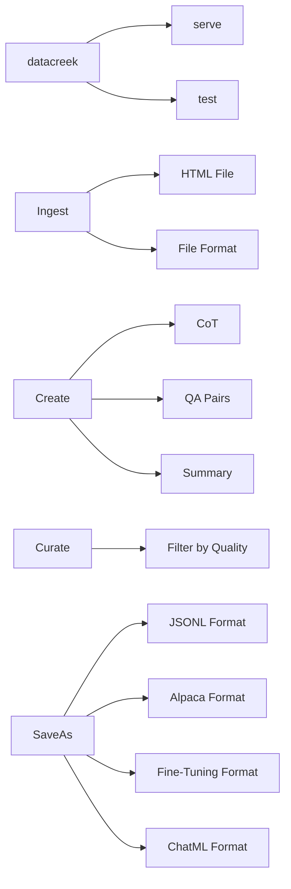

# Datacreek

Tool for generating high-quality synthetic datasets to fine-tune LLMs.

Generate Reasoning Traces, QA Pairs, save them to a fine-tuning format with a simple CLI.

> [Checkout our guide on using the tool to unlock task-specific reasoning in Llama-3 family](https://github.com/meta-llama/datacreek/tree/main/use-cases/adding_reasoning_to_llama_3)

# What does Datacreek offer? 

Fine-Tuning Large Language Models is easy. There are many mature tools that you can use to fine-tune Llama model family using various post-training techniques.

### Why target data preparation?

Multiple tools support standardized formats. However, most of the times your dataset is not structured in "user", "assistant" threads or in a certain format that plays well with a fine-tuning packages. 

This toolkit simplifies the journey of:

- Using a LLM (vLLM or any local/external API endpoint) to generate examples
- Modular 4 command flow
- Converting your existing files to fine-tuning friendly formats
- Creating synthetic datasets
- Supporting various formats of post-training fine-tuning

# How does Datacreek offer it? 

The tool is designed to follow a simple CLI structure with 4 commands:

- `ingest` various file formats
- `create` your fine-tuning format: `QA` pairs, `QA` pairs with CoT, `summary` format
- `curate`: Using Llama as a judge to curate high quality examples. 
- `save-as`: After that you can simply save these to a format that your fine-tuning workflow requires.

You can override any parameter or detail by either using the CLI or overriding the default YAML config.


### Installation

#### From PyPI

```bash
# Create a new environment

conda create -n synthetic-data python=3.10 

conda activate synthetic-data

pip install datacreek
```

#### (Alternatively) From Source

```bash
git clone https://github.com/meta-llama/datacreek.git
cd datacreek
pip install -e .
```

To get an overview of commands type: 

`datacreek --help`

### 1. Tool Setup

- The tool expects respective files to be put in named folders.

```bash
# Create directory structure
mkdir -p data/{pdf,html,youtube,docx,ppt,txt,output,generated,cleaned,final}
```

- You also need a LLM backend that you will utilize for generating your dataset, if using vLLM:

```bash
# Start vLLM server
# Note you will need to grab your HF Authentication from: https://huggingface.co/settings/tokens
vllm serve meta-llama/Llama-3.3-70B-Instruct --port 8000
```

### 2. Usage

Start the REST API server with the CLI then interact with the endpoints.

```bash
# Launch the API server
datacreek serve --host 0.0.0.0 --port 8000
```

The API exposes `/ingest`, `/generate`, `/curate` and `/save` endpoints that mirror
the previous CLI commands.
## Configuration

The toolkit uses a YAML configuration file (default: `configs/config.yaml`).

Note, this can be overridden via either CLI arguments OR passing a custom YAML file

```yaml
# Example configuration using vLLM
llm:
  provider: "vllm"

vllm:
  api_base: "http://localhost:8000/v1"
  model: "meta-llama/Llama-3.3-70B-Instruct"

generation:
  temperature: 0.7
  chunk_size: 4000
  num_pairs: 25

curate:
  threshold: 7.0
  batch_size: 8
```

or using an API endpoint:

```yaml
# Example configuration using the llama API
llm:
  provider: "api-endpoint"

api-endpoint:
  api_base: "https://api.llama.com/v1"
  api_key: "llama-api-key"
  model: "Llama-4-Maverick-17B-128E-Instruct-FP8"
```

### Customizing Configuration

Create a overriding configuration file and use it with the `-c` flag:

```bash
curl -X POST localhost:8000/ingest -d "path=docs/paper.pdf"
```

## Examples

### Processing a PDF Document

```bash
# Ingest PDF
curl -X POST localhost:8000/ingest -d "path=research_paper.pdf"

# Generate QA pairs (assuming source ID 1)
curl -X POST localhost:8000/generate -d "src_id=1&num_pairs=30"

# Curate data (dataset ID 1)
curl -X POST localhost:8000/curate -d "ds_id=1&threshold=8.5"

# Save in OpenAI fine-tuning format
curl -X POST localhost:8000/save -d "ds_id=1&fmt=jsonl"
```

### Processing a YouTube Video

```bash
# Extract transcript and generate QA pairs
curl -X POST localhost:8000/ingest -d "path=https://www.youtube.com/watch?v=dQw4w9WgXcQ"
curl -X POST localhost:8000/generate -d "src_id=1"
```

### Processing Multiple Files

```bash
# Bash script to process multiple files
for file in data/pdf/*.pdf; do
  filename=$(basename "$file" .pdf)

  curl -X POST localhost:8000/ingest -d "path=$file"
  curl -X POST localhost:8000/generate -d "src_id=1&num_pairs=20"
  curl -X POST localhost:8000/curate -d "ds_id=1&threshold=7.5"
  curl -X POST localhost:8000/save -d "ds_id=1&fmt=chatml"
done
```

## Advanced Usage

### Custom Prompt Templates

Edit the `prompts` section in your configuration file to customize generation behavior:

```yaml
prompts:
  qa_generation: |
    You are creating question-answer pairs for fine-tuning a legal assistant.
    Focus on technical legal concepts, precedents, and statutory interpretation.
    
    Below is a chunk of text about: {summary}...
    
    Create {num_pairs} high-quality question-answer pairs based ONLY on this text.
    
    Return ONLY valid JSON formatted as:
    [
      {
        "question": "Detailed legal question?",
        "answer": "Precise legal answer."
      },
      ...
    ]
    
    Text:
    ---
    {text}
    ---
```

### Mental Model:



## Troubleshooting FAQs:

### vLLM Server Issues

- Ensure vLLM is installed: `pip install vllm`
- Start server with: `vllm serve <model_name> --port 8000`
- Check connection: `curl http://localhost:8000/docs`

### Memory Issues

If you encounter CUDA out of memory errors:
- Use a smaller model
- Reduce batch size in config
- Start vLLM with `--gpu-memory-utilization 0.85`

### JSON Parsing Issues

If you encounter issues with the `curate` command:
- Use the `-v` flag to enable verbose output
- Set smaller batch sizes in your config.yaml
- Ensure the LLM model supports proper JSON output
- Install json5 for enhanced JSON parsing: `pip install json5`

### Parser Errors

- Ensure required dependencies are installed for specific parsers:
  - PDF: `pip install pdfminer.six`
  - HTML: `pip install beautifulsoup4`
  - YouTube: `pip install pytubefix youtube-transcript-api`
  - DOCX: `pip install python-docx`
  - PPTX: `pip install python-pptx`

## License

Read more about the [License](./LICENSE)

## Contributing

Contributions are welcome! [Read our contributing guide](./CONTRIBUTING.md)
