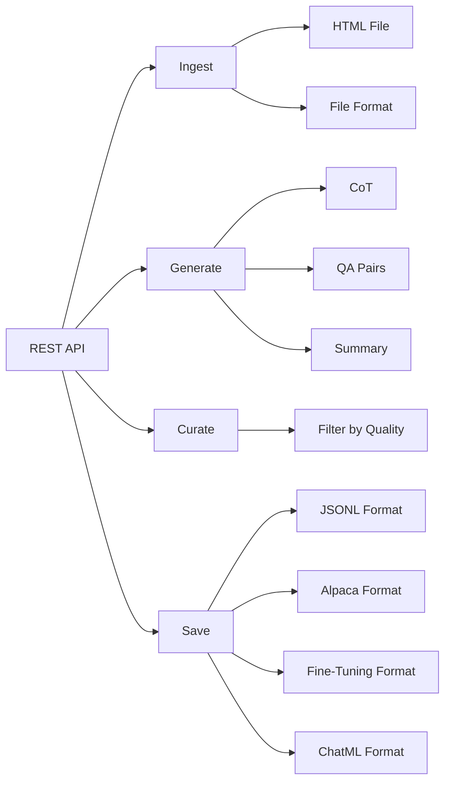

# Datacreek

Tool for generating high-quality synthetic datasets to fine-tune LLMs.

Generate reasoning traces and QA pairs and save them to common fine-tuning formats.

> [Checkout our guide on using the tool to unlock task-specific reasoning in Llama-3 family](https://github.com/meta-llama/datacreek/tree/main/use-cases/adding_reasoning_to_llama_3)

# What does Datacreek offer? 

Fine-Tuning Large Language Models is easy. There are many mature tools that you can use to fine-tune Llama model family using various post-training techniques.

### Why target data preparation?

Multiple tools support standardized formats. However, most of the times your dataset is not structured in "user", "assistant" threads or in a certain format that plays well with a fine-tuning packages. 

This toolkit simplifies the journey of:

- Using a LLM (vLLM or any local/external API endpoint) to generate examples
- Converting your existing files to fine-tuning friendly formats
- Creating synthetic datasets
- Supporting various formats of post-training fine-tuning

# How does Datacreek offer it?

The toolkit exposes a REST API that mirrors the main data preparation steps. All
operations are asynchronous and keyed by users:

- `/tasks/ingest` for converting raw files to text
- `/tasks/generate` for creating datasets
- `/tasks/curate` for quality filtering
- `/tasks/save` for exporting in common fine-tuning formats
- `/datasets` to manage generated datasets

 All behaviour is driven from a YAML configuration file that you can override with your own values.


### Installation

#### From PyPI

```bash
# Create a new environment

conda create -n synthetic-data python=3.10 

conda activate synthetic-data

pip install datacreek
```

#### (Alternatively) From Source

```bash
git clone https://github.com/meta-llama/datacreek.git
cd datacreek
pip install -e .
```

### 1. Tool Setup

- The tool expects respective files to be put in named folders.

```bash
# Create directory structure
mkdir -p data/{pdf,html,youtube,docx,ppt,txt,output,generated,cleaned,final}
```

- You also need a LLM backend that you will utilize for generating your dataset, if using vLLM:

```bash
# Start vLLM server
# Note you will need to grab your HF Authentication from: https://huggingface.co/settings/tokens
vllm serve meta-llama/Llama-3.3-70B-Instruct --port 8000
```

### 2. Usage

Start the REST API server and interact with the endpoints.

All operations run asynchronously. Use `/tasks/ingest`, `/tasks/generate`,
`/tasks/curate` and `/tasks/save` to launch long running processes in the
background. Each request returns a `task_id` which can be polled via
`/tasks/{task_id}`.

Tasks are executed by [Celery](https://docs.celeryq.dev/). By default an in-memory
broker is used, but in production you should set `CELERY_BROKER_URL` and
`CELERY_RESULT_BACKEND` to a Redis or RabbitMQ instance.

Datasets can be managed through `/datasets` (create, list, update, delete and
download). Every request must include an `X-API-Key` header issued when creating
a user via `/users`.
## Configuration

The toolkit uses a YAML configuration file (default: `configs/config.yaml`).
Database connection settings can be provided either through the
`DATABASE_URL` environment variable or a `database.url` entry in the YAML
file. By default a local SQLite file `datacreek.db` is used, but you can
point this to any SQLAlchemy compatible database.

### Database initialization

Run `python -m datacreek.cli init-db` to create the tables before starting the
server if they do not already exist.

You can override any value by providing a custom YAML file to the server.

```yaml
# Example configuration using vLLM
llm:
  provider: "vllm"

vllm:
  api_base: "http://localhost:8000/v1"
  model: "meta-llama/Llama-3.3-70B-Instruct"

generation:
  temperature: 0.7
  chunk_size: 4000
  num_pairs: 25

curate:
  threshold: 7.0
  batch_size: 8
```

or using an API endpoint:

```yaml
# Example configuration using the llama API
llm:
  provider: "api-endpoint"

api-endpoint:
  api_base: "https://api.llama.com/v1"
  api_key: "llama-api-key"
  model: "Llama-4-Maverick-17B-128E-Instruct-FP8"
```

### Customizing Configuration

Create a custom configuration file and pass it via the `X-Config-Path` header:

```bash
curl -X POST localhost:8000/tasks/ingest \
     -H "X-Config-Path: custom_config.yaml" \
     -H "X-API-Key: <key>" \
     -d "path=docs/paper.pdf"
```

## Examples

### Processing a PDF Document

```bash
# Ingest PDF
curl -X POST localhost:8000/tasks/ingest -d "path=research_paper.pdf" -H "X-API-Key: <key>"

# Generate QA pairs (assuming source ID 1)
curl -X POST localhost:8000/tasks/generate -d "src_id=1&num_pairs=30" -H "X-API-Key: <key>"

# Curate data (dataset ID 1)
curl -X POST localhost:8000/tasks/curate -d "ds_id=1&threshold=8.5" -H "X-API-Key: <key>"

# Save in OpenAI fine-tuning format
curl -X POST localhost:8000/tasks/save -d "ds_id=1&fmt=jsonl" -H "X-API-Key: <key>"
```

### Processing a YouTube Video

```bash
# Extract transcript and generate QA pairs
curl -X POST localhost:8000/tasks/ingest -d "path=https://www.youtube.com/watch?v=dQw4w9WgXcQ" -H "X-API-Key: <key>"
curl -X POST localhost:8000/tasks/generate -d "src_id=1" -H "X-API-Key: <key>"
```

### Processing Multiple Files

```bash
# Bash script to process multiple files
for file in data/pdf/*.pdf; do
  filename=$(basename "$file" .pdf)

  curl -X POST localhost:8000/tasks/ingest -d "path=$file" -H "X-API-Key: <key>"
  curl -X POST localhost:8000/tasks/generate -d "src_id=1&num_pairs=20" -H "X-API-Key: <key>"
  curl -X POST localhost:8000/tasks/curate -d "ds_id=1&threshold=7.5" -H "X-API-Key: <key>"
  curl -X POST localhost:8000/tasks/save -d "ds_id=1&fmt=chatml" -H "X-API-Key: <key>"
done
```

## Advanced Usage

### Custom Prompt Templates

Edit the `prompts` section in your configuration file to customize generation behavior:

```yaml
prompts:
  qa_generation: |
    You are creating question-answer pairs for fine-tuning a legal assistant.
    Focus on technical legal concepts, precedents, and statutory interpretation.
    
    Below is a chunk of text about: {summary}...
    
    Create {num_pairs} high-quality question-answer pairs based ONLY on this text.
    
    Return ONLY valid JSON formatted as:
    [
      {
        "question": "Detailed legal question?",
        "answer": "Precise legal answer."
      },
      ...
    ]
    
    Text:
    ---
    {text}
    ---
```

Each dataset you create owns its own knowledge graph. During ingestion the
selected documents are inserted into this graph and linked to their original
source.  Generation steps query this cleaned graph instead of the raw files.
The graph exposes simple search helpers so you can explore the content:

```python
from datacreek import DatasetBuilder, DatasetType

ds = DatasetBuilder(DatasetType.QA, name="example")
ds.add_document("doc1", source="paper.pdf")
ds.add_chunk("doc1", "c1", "hello world")
print(ds.search("hello"))  # ["c1"]
print(ds.search_documents("paper"))  # ["doc1"]
print(ds.get_chunks_for_document("doc1"))  # ["c1"]

# Clone a dataset to experiment with different cleaning steps
ds_copy = ds.clone(name="copy")
```

### Mental Model:



## Dataset Generation Pipelines

After ingestion, parsed content is placed into a knowledge graph. Generation
pipelines operate on this graph and are specialized for different training goals.

| Dataset type | Compatible trainings |
|--------------|---------------------|
| `qa`         | SFT, DPO, ORPO, DPO+SFT, PPO, RRHF, RLAIF, GRPO |
| `cot`        | SFT, DPO, ORPO, DPO+SFT, RRHF |
| `vqa`        | SFT |
| `text`       | CPT |
| `kg`         | SFT, DPO, ORPO, DPO+SFT, PPO, RRHF, RLAIF, GRPO |
| `pref_pair`  | PPO, DPO, ORPO, DPO+SFT, RLAIF |
| `pref_list`  | GRPO, RRHF |
| `tool`       | SFT, DPO, ORPO, DPO+SFT, PPO, RRHF, RLAIF, GRPO |
| `conversation` | SFT, DPO, ORPO, DPO+SFT, PPO, RRHF, RLAIF, GRPO |
| `multi_tool` | SFT, DPO, ORPO, DPO+SFT, PPO, RRHF, RLAIF, GRPO |

You can query pipelines programmatically:

```python
from datacreek import get_pipelines_for_training, TrainingGoal
print(get_pipelines_for_training(TrainingGoal.SFT))
```

## Troubleshooting FAQs:

### vLLM Server Issues

- Ensure vLLM is installed: `pip install vllm`
- Start server with: `vllm serve <model_name> --port 8000`
- Check connection: `curl http://localhost:8000/docs`

### Memory Issues

If you encounter CUDA out of memory errors:
- Use a smaller model
- Reduce batch size in config
- Start vLLM with `--gpu-memory-utilization 0.85`

### JSON Parsing Issues

If you encounter issues during the curation step:
- Enable verbose logging
- Set smaller batch sizes in your config.yaml
- Ensure the LLM model supports proper JSON output
- Install json5 for enhanced JSON parsing: `pip install json5`

### Parser Errors

- Ensure required dependencies are installed for specific parsers:
  - PDF: `pip install pdfminer.six`
  - HTML: `pip install beautifulsoup4`
  - YouTube: `pip install pytubefix youtube-transcript-api`
  - DOCX: `pip install python-docx`
  - PPTX: `pip install python-pptx`

## License

Read more about the [License](./LICENSE)

## Contributing

Contributions are welcome! [Read our contributing guide](./CONTRIBUTING.md)
