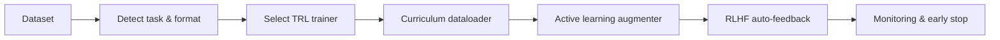

# Adaptive Training Pipeline

This guide explains how to fine‑tune language models with the Unsloth+TRL adaptive pipeline.
It covers model loading, task detection, trainer selection and optional components such as
curriculum learning, active‑learning augmentation and graph‑based auto‑feedback.

## Pipeline overview



## Quick start

```bash
python -m cli.train \
    --model Uns12B \
    --dataset-path /data/myset.jsonl \
    --task auto \
    --epochs 3
```

The command automatically:

1. loads the model in 4‑bit mode via `training.unsloth_loader.load_model`,
2. infers the dataset task with `training.task_detector.detect_task`,
3. builds the appropriate TRL trainer through `training.trainer_factory.build_trainer`, and
4. iterates over a curriculum‑sorted dataloader while emitting Weights & Biases
   and Prometheus metrics.

### Optional arguments

| Flag | Purpose |
|------|---------|
| `--alpha`, `--beta` | Hyperparameters used by some loss functions. |
| `--bits` | Quantization bits passed to `load_model`. |
| `--trainer` | Override the trainer type (`sft`, `ppo`, `dpo`). |

## Examples

To fine‑tune for classification:

```bash
python -m cli.train --model Uns7B --task classification --dataset-path dbpedia.jsonl
```

To run PPO with graph‑based rewards:

```bash
python -m cli.train --trainer ppo --dataset-path pairs.jsonl --model Uns7B
```

Refer to [`training/`](../training/) modules for API details.
